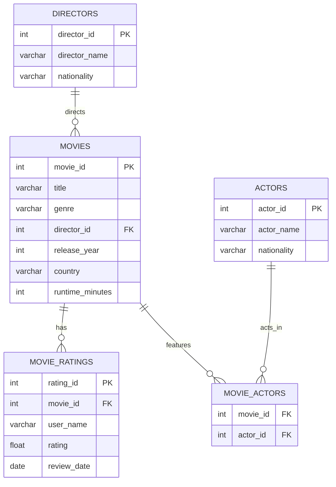

# 🎬 1:N Relationships with Foreign Keys
---
## 🔑KEYWORDS
- **Primary Key**
- **Foreign Key**
- **Referential Integrity**
- **One-to-Many Relationship**
- **Constraints**
---
## 📖DEFINITION
- **Foreign Key** – A column in one table that references the **primary key** of another table, establishing a relationship between the two.  
- **1:N Relationship** – A situation where **one row** in a table can be associated with **many rows** in another table. Example: One **director** can direct many **movies**, but each **movie** has only one director.
---
## 🧱QUERY FORMAT
```sql
-- Creating a table with foreign key
CREATE TABLE child_table (
    id INT PRIMARY KEY,
    parent_id INT,
    FOREIGN KEY (parent_id) REFERENCES parent_table(primary_key)
);

-- Adding foreign key to existing table
ALTER TABLE child_table
ADD CONSTRAINT fk_name FOREIGN KEY (parent_id) REFERENCES parent_table(primary_key);
```
---
## 💡TIP TO REMEMBER
- A **foreign key** does not need to be unique.  
- **NULL** values are allowed in foreign key columns.  
- Foreign keys maintain **referential integrity**: you can’t insert a child record if the parent record doesn’t exist.  
---
## 🗂️ ER DIAGRAM (Movies Database)

---
## 💪EXERCISE
Before moving to the exercises, we need a platform with tables and data.  
For this, we have a setup file available inside the same directory: [CLICK AND EXECUTE FILE FIRST](https://github.com/code4coin/001-SQL-Structured-Query-Language-/blob/main/001%20SQL%20FOR%20DATA%20ENGINEERS/002%20SAMPLE%20DATA/001%20MOVIE%20DATA.md)

---

### 1. Find all movies directed by **Christopher Nolan**.  
✅ **Solution**
```sql
SELECT m.title, m.release_year, d.director_name
FROM movies m
JOIN directors d ON m.director_id = d.director_id
WHERE d.director_name = 'Christopher Nolan';
```

---

### 2. Get all movies along with their directors (1:N relationship).  
✅ **Solution**
```sql
SELECT m.title, d.director_name
FROM movies m
JOIN directors d ON m.director_id = d.director_id;
```
---

### 3. Show all ratings given for the movie **Inception**.  
✅ **Solution**
```sql
SELECT m.title, r.user_name, r.rating
FROM movie_ratings r
JOIN movies m ON r.movie_id = m.movie_id
WHERE m.title = 'Inception';
```
---

### 4. List all actors who worked in movies directed by **Quentin Tarantino**.  
✅ **Solution**
```sql
SELECT DISTINCT a.actor_name, m.title
FROM actors a
JOIN movie_actors ma ON a.actor_id = ma.actor_id
JOIN movies m ON ma.movie_id = m.movie_id
JOIN directors d ON m.director_id = d.director_id
WHERE d.director_name = 'Quentin Tarantino';
```

---

### 5. Find the average rating of each movie (foreign key: `movie_ratings.movie_id → movies.movie_id`).  
✅ **Solution**
```sql
SELECT m.title, AVG(r.rating) AS avg_rating
FROM movies m
JOIN movie_ratings r ON m.movie_id = r.movie_id
GROUP BY m.title
ORDER BY avg_rating DESC;
```
---
## 🧠Practise
1. Find all movies directed by **Steven Spielberg**.  
2. Show all actors who acted in **Christopher Nolan’s** movies.  
3. List movies that have **average rating > 9.0**.  
4. Get all movies released after 2010 with their director names.  
5. Show each actor and how many movies they acted in.  

---
## ✅SOLUTIONS
### 1. Find all movies directed by **Steven Spielberg**.  
```sql
SELECT m.title, m.release_year
FROM movies m
JOIN directors d ON m.director_id = d.director_id
WHERE d.director_name = 'Steven Spielberg';
```

### 2. Show all actors who acted in **Christopher Nolan’s** movies.  
```sql
SELECT DISTINCT a.actor_name
FROM actors a
JOIN movie_actors ma ON a.actor_id = ma.actor_id
JOIN movies m ON ma.movie_id = m.movie_id
JOIN directors d ON m.director_id = d.director_id
WHERE d.director_name = 'Christopher Nolan';
```

### 3. List movies that have **average rating > 9.0**.  
```sql
SELECT m.title, AVG(r.rating) AS avg_rating
FROM movies m
JOIN movie_ratings r ON m.movie_id = r.movie_id
GROUP BY m.title
HAVING AVG(r.rating) > 9.0;
```

### 4. Get all movies released after 2010 with their director names.  
```sql
SELECT m.title, m.release_year, d.director_name
FROM movies m
JOIN directors d ON m.director_id = d.director_id
WHERE m.release_year > 2010;
```

### 5. Show each actor and how many movies they acted in.  
```sql
SELECT a.actor_name, COUNT(ma.movie_id) AS movie_count
FROM actors a
JOIN movie_actors ma ON a.actor_id = ma.actor_id
GROUP BY a.actor_name
ORDER BY movie_count DESC;
```

---
## 🤝**CONTRIBUTING** 
We welcome contributions! You can:
- Add new SQL exercises  
- Improve existing chapters or examples  
- Share interview questions or projects  

Please open a **pull request** or **issue** to contribute.  

---
## 📄**LICENSE** 
This repository is free to use for learning purposes. Please give credit if used in your projects or materials.  

---
## 🔗**MORE RESOURCES** 
Stay connected and explore more content:  
- **LinkedIn:** [https://www.linkedin.com/in/nitin22/](https://www.linkedin.com/in/nitin22/)  
- **YouTube:** [https://www.youtube.com/@code4coin](https://www.youtube.com/@code4coin)  
- **Instagram:** [https://www.instagram.com/code4coin/](https://www.instagram.com/code4coin/)  
