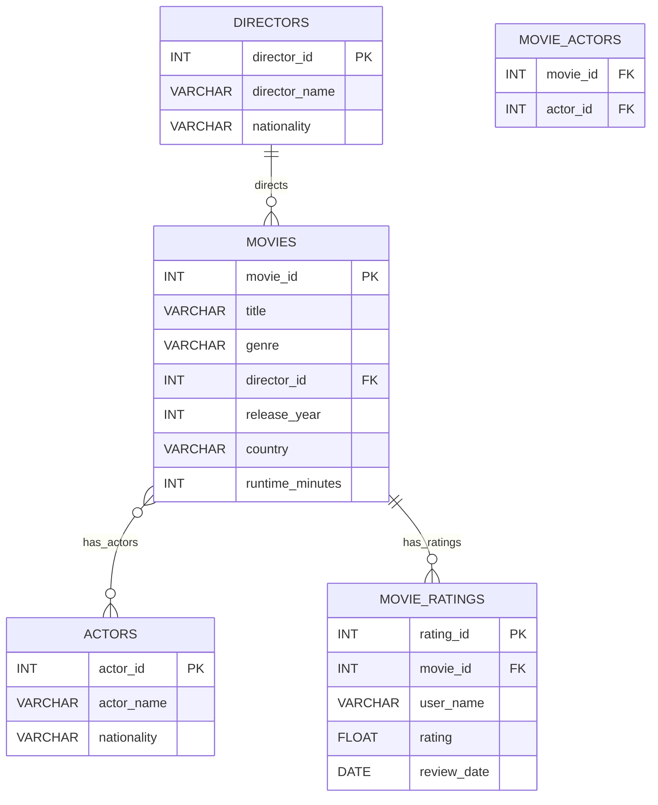
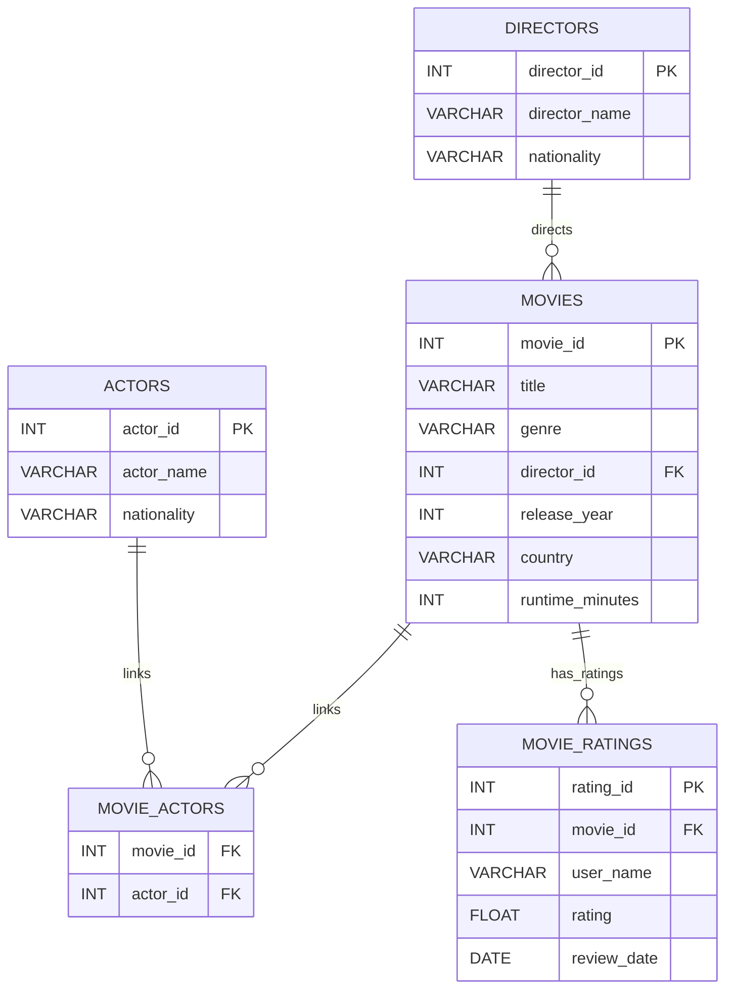

# M:N MODELING COMPLEX RELATIONSHIPS

---

## 🔑KEYWORDS

* **1\:N Relationship** 
* **N\:M Relationship** 
* **Linking Table** 
* **Foreign Key**
* **Aggregation** 

---

## 📖DEFINITION

* **1\:N Relationship** – A single entity in one table is related to multiple entities in another table. Example: one director can direct many movies.
* **N\:M Relationship** – Multiple entities in one table can relate to multiple entities in another table. Example: a movie can have many actors, and an actor can appear in many movies.
* **Linking Table** – A table that connects two entities in an N\:M relationship and may also store additional attributes. Example: `movie_actors`.

---

## 🧱QUERY FORMAT

### 1\:N Relationship Example

```sql
SELECT m.title, m.release_year
FROM movies m
JOIN directors d ON m.director_id = d.director_id
WHERE d.director_name = 'Christopher Nolan';
```

### N\:M Relationship Example

```sql
SELECT m.title, m.release_year
FROM movies m
JOIN movie_actors ma ON m.movie_id = ma.movie_id
JOIN actors a ON ma.actor_id = a.actor_id
WHERE a.actor_name = 'Leonardo DiCaprio';
```

### N\:M Relationship with Aggregation

```sql
SELECT a.actor_name, AVG(r.rating) AS avg_rating
FROM actors a
JOIN movie_actors ma ON a.actor_id = ma.actor_id
JOIN movies m ON ma.movie_id = m.movie_id
JOIN movie_ratings r ON m.movie_id = r.movie_id
WHERE a.actor_name = 'Brad Pitt'
GROUP BY a.actor_name;
```

---

## 💡TIP TO REMEMBER

* Always identify the **type of relationship** before designing tables.
* Think “two 1:N relationships” to model one N:M relationship:
  - One 1:N between left table and the bridge.
  - One 1:N between right table and the bridge.
* Use **foreign keys** for 1\:N relationships and **linking tables** for N\:M relationships.
* Aggregations like AVG(), COUNT(), SUM() can help extract insights from relationships.
* Linking tables can store **additional attributes** like roles or functions.

---
## 🗂️ ER DIAGRAM (Movies Database - With M:N Relationship with Table: Movies, Actors)

This diagram shows all major relationships:

* **Directors → Movies** (1\:N)
* **Movies ↔ Actors** (N\:M)
* **Movies → Movie Ratings** (1\:N)

## 🗂️ ER DIAGRAM (Movies Database - Introducing Junction table: Movie_Actors Replacing M:N relationship of table:Movies, Actors)

This diagram shows all major relationships:

* **Directors → Movies** (1\:N)
* **Movies → Movies_Actors** (1\:N)
* **Actors → Movies_Actors** (1\:N)
* **Movies → Movie Ratings** (1\:N)


---

## 💪EXERCISE

Before moving to the exercises, we need a platform with tables and data.
For this, we have a setup file available inside the same directory: [CLICK AND EXECUTE FILE FIRST](https://github.com/code4coin/001-SQL-Structured-Query-Language-/blob/main/001%20SQL%20FOR%20DATA%20ENGINEERS/002%20SAMPLE%20DATA/001%20MOVIE%20DATA.md)

### 1. List all movies directed by *Steven Spielberg*.
✅ **Solution**
```sql
SELECT m.title, m.release_year
FROM movies m
JOIN directors d ON m.director_id = d.director_id
WHERE d.director_name = 'Steven Spielberg';
```
### 2. Find all actors who acted in *Pulp Fiction*.
✅ **Solution**
```sql
SELECT a.actor_name
FROM actors a
JOIN movie_actors ma ON a.actor_id = ma.actor_id
JOIN movies m ON ma.movie_id = m.movie_id
WHERE m.title = 'Pulp Fiction';
```
### 3. Calculate the average rating of movies in the *Sci-Fi* genre.
✅ **Solution**
```sql
SELECT AVG(r.rating) AS avg_sci_fi_rating
FROM movies m
JOIN movie_ratings r ON m.movie_id = r.movie_id
WHERE m.genre = 'Sci-Fi';
```
### 4. List all movies in which *Tom Hanks* and *Matt Damon* both acted (if any).
✅ **Solution**
```sql
SELECT m.title
FROM movies m
JOIN movie_actors ma1 ON m.movie_id = ma1.movie_id
JOIN actors a1 ON ma1.actor_id = a1.actor_id
JOIN movie_actors ma2 ON m.movie_id = ma2.movie_id
JOIN actors a2 ON ma2.actor_id = a2.actor_id
WHERE a1.actor_name = 'Tom Hanks' AND a2.actor_name = 'Matt Damon';
```
### 5. Find the total number of actors in each movie.
✅ **Solution**
```sql
SELECT m.title, COUNT(ma.actor_id) AS total_actors
FROM movies m
JOIN movie_actors ma ON m.movie_id = ma.movie_id
GROUP BY m.title;
```
### 6. List all actors who acted in movies directed by *Quentin Tarantino*.
✅ **Solution**
```sql
SELECT DISTINCT a.actor_name
FROM actors a
JOIN movie_actors ma ON a.actor_id = ma.actor_id
JOIN movies m ON ma.movie_id = m.movie_id
JOIN directors d ON m.director_id = d.director_id
WHERE d.director_name = 'Quentin Tarantino';
```
### 7. Show all movies along with the director name and the number of actors in each movie.
✅ **Solution**
```sql
SELECT m.title, d.director_name, COUNT(ma.actor_id) AS actor_count
FROM movies m
JOIN directors d ON m.director_id = d.director_id
LEFT JOIN movie_actors ma ON m.movie_id = ma.movie_id
GROUP BY m.title, d.director_name;
```
---

## 🧠Practise

1. Find all movies released after 2010 along with their director names.
2. List all actors who have appeared in more than 2 movies.
3. Find the highest-rated movie for each director.
4. Show all actors and the number of Sci-Fi movies they acted in.
5. List movies that do not have any ratings yet.

---

## ✅SOLUTIONS

**1. Movies released after 2010 with director**

```sql
SELECT m.title, d.director_name
FROM movies m
JOIN directors d ON m.director_id = d.director_id
WHERE m.release_year > 2010;
```

**2. Actors in more than 2 movies**

```sql
SELECT a.actor_name, COUNT(ma.movie_id) AS movie_count
FROM actors a
JOIN movie_actors ma ON a.actor_id = ma.actor_id
GROUP BY a.actor_name
HAVING COUNT(ma.movie_id) > 2;
```

**3. Highest-rated movie for each director**

```sql
SELECT d.director_name, m.title, MAX(r.rating) AS max_rating
FROM directors d
JOIN movies m ON d.director_id = m.director_id
JOIN movie_ratings r ON m.movie_id = r.movie_id
GROUP BY d.director_name, m.title;
```

**4. Actors and number of Sci-Fi movies acted**

```sql
SELECT a.actor_name, COUNT(m.movie_id) AS sci_fi_count
FROM actors a
JOIN movie_actors ma ON a.actor_id = ma.actor_id
JOIN movies m ON ma.movie_id = m.movie_id
WHERE m.genre = 'Sci-Fi'
GROUP BY a.actor_name;
```

**5. Movies without ratings**

```sql
SELECT m.title
FROM movies m
LEFT JOIN movie_ratings r ON m.movie_id = r.movie_id
WHERE r.rating_id IS NULL;
```

---

## 🤝**CONTRIBUTING**

We welcome contributions! You can:

* Add new SQL exercises
* Improve existing chapters or examples
* Share interview questions or projects

Please open a **pull request** or **issue** to contribute.

---

## 📄**LICENSE**

This repository is free to use for learning purposes. Please give credit if used in your projects or materials.

---

## 🔗**MORE RESOURCES**

Stay connected and explore more content:

* **LinkedIn:** [https://www.linkedin.com/in/nitin22/](https://www.linkedin.com/in/nitin22/)
* **YouTube:** [https://www.youtube.com/@code4coin](https://www.youtube.com/@code4coin)
* **Instagram:** [https://www.instagram.com/code4coin/](https://www.instagram.com/code4coin/)
