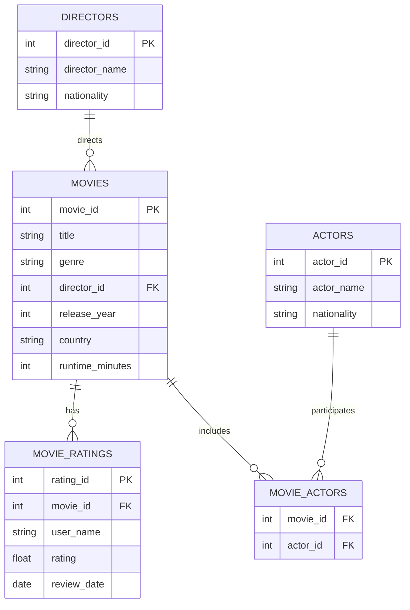
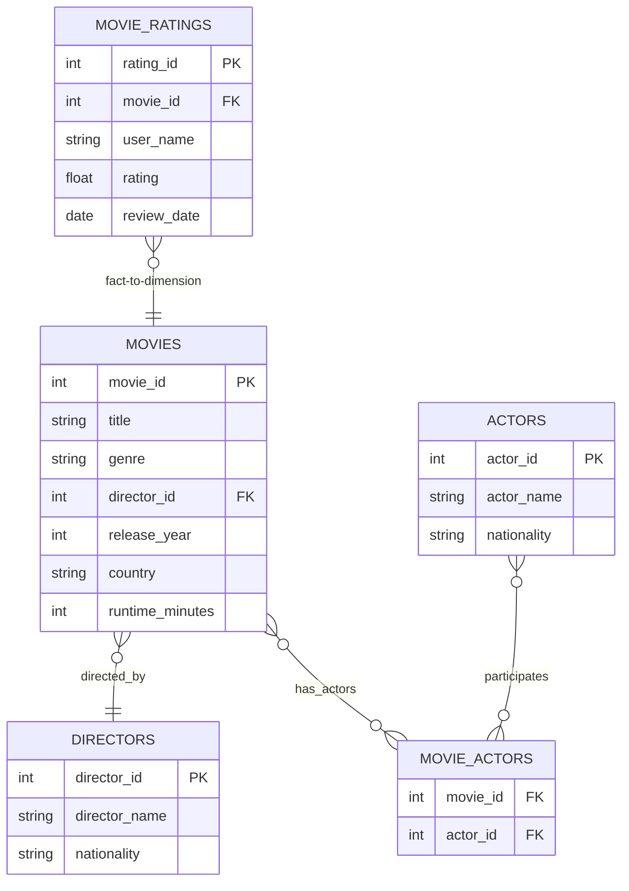

# 📘 DATABASE DESIGN
---
## 🔑KEYWORDS
- **Database Design**
- **Schema**
- **Data Modeling**
- **Entity-Relationship Diagram (ERD)**
- **Normalization**
- **Fact & Dimension Tables**
---
## 📖DEFINITION
- **Database Design** – The process of structuring data in a logical way for efficient storage, retrieval, and management. It involves schemas, data models, and relationships.  
- **Schema** – A blueprint of the database defining tables, fields, and relationships.  
- **Fact Table** – Stores measurable data (e.g., ratings).  
- **Dimension Table** – Stores descriptive attributes (e.g., movies, directors, actors).  
---
## 🧱QUERY FORMAT
Some useful formats in database design:
```sql
-- Example 1: Join tables
SELECT m.title, d.director_name
FROM movies m
JOIN directors d ON m.director_id = d.director_id;
```
```sql
-- Example 2: Aggregation
SELECT genre, AVG(rating) AS avg_rating
FROM movies m
JOIN movie_ratings r ON m.movie_id = r.movie_id
GROUP BY genre;
```
---
## 💡TIP TO REMEMBER
- Always start with a **conceptual model** (entities & relationships).  
- Normalize to reduce redundancy, denormalize for faster queries when needed.  
- In dimensional modeling: **Fact tables change often**, **dimension tables change less**.  
---
## 📊 ENTITY RELATIONSHIP DIAGRAM (ERD)


---
## ⭐ STAR SCHEMA (Dimensional Model)


---
## 💪EXERCISE
Before moving to the exercises, we need a platform with tables and data.  
For this, we have a setup file available inside the same directory:  
[CLICK AND EXECUTE FILE FIRST](https://github.com/code4coin/001-SQL-Structured-Query-Language-/blob/main/001%20SQL%20FOR%20DATA%20ENGINEERS/002%20SAMPLE%20DATA/001%20MOVIE%20DATA.md)

---

### 1. Find all movies directed by *Christopher Nolan*.  
<details>
  <summary>✅ Solution:</summary>

```sql
SELECT m.title, m.release_year
FROM movies m
JOIN directors d ON m.director_id = d.director_id
WHERE d.director_name = 'Christopher Nolan';
```
</details>

---

### 2. List all actors who acted in *Interstellar*.  
<details>
  <summary>✅ Solution:</summary>

```sql
SELECT a.actor_name
FROM actors a
JOIN movie_actors ma ON a.actor_id = ma.actor_id
JOIN movies m ON ma.movie_id = m.movie_id
WHERE m.title = 'Interstellar';
```
</details>

---

### 3. Find the **average rating** of each movie.  
<details>
  <summary>✅ Solution:</summary>

```sql
SELECT m.title, ROUND(AVG(r.rating),2) AS avg_rating
FROM movies m
JOIN movie_ratings r ON m.movie_id = r.movie_id
GROUP BY m.title
ORDER BY avg_rating DESC;
```
</details>

---

### 4. Get the **highest-rated movie** of each director.  
<details>
  <summary>✅ Solution:</summary>

```sql
SELECT d.director_name, m.title, MAX(r.rating) AS top_rating
FROM directors d
JOIN movies m ON d.director_id = m.director_id
JOIN movie_ratings r ON m.movie_id = r.movie_id
GROUP BY d.director_name, m.title
ORDER BY d.director_name, top_rating DESC;
```
</details>

---

### 5. Count how many movies each actor has acted in.  
<details>
  <summary>✅ Solution:</summary>

```sql
SELECT a.actor_name, COUNT(ma.movie_id) AS movie_count
FROM actors a
JOIN movie_actors ma ON a.actor_id = ma.actor_id
GROUP BY a.actor_name
ORDER BY movie_count DESC;
```
</details>

---
## 🧠Practise
1. Find all movies released after 2010 with an average rating above 9.  
2. Get the total number of ratings each genre has received.  
3. Find the top 3 movies with the longest runtime.  
4. List all actors who worked with Steven Spielberg.  
5. Get the director whose movies have the highest overall average rating.  

## ✅SOLUTIONS

### 1. Find all movies released after 2010 with an average rating above 9.  
```sql
SELECT m.title, AVG(r.rating) AS avg_rating
FROM movies m
JOIN movie_ratings r ON m.movie_id = r.movie_id
WHERE m.release_year > 2010
GROUP BY m.title
HAVING AVG(r.rating) > 9;
```

---

### 2. Get the total number of ratings each genre has received.  
```sql
SELECT m.genre, COUNT(r.rating_id) AS total_ratings
FROM movies m
JOIN movie_ratings r ON m.movie_id = r.movie_id
GROUP BY m.genre
ORDER BY total_ratings DESC;
```

---

### 3. Find the top 3 movies with the longest runtime.  
```sql
SELECT title, runtime_minutes
FROM movies
ORDER BY runtime_minutes DESC
LIMIT 3;
```

---

### 4. List all actors who worked with Steven Spielberg.  
```sql
SELECT DISTINCT a.actor_name
FROM actors a
JOIN movie_actors ma ON a.actor_id = ma.actor_id
JOIN movies m ON ma.movie_id = m.movie_id
JOIN directors d ON m.director_id = d.director_id
WHERE d.director_name = 'Steven Spielberg';
```

---

### 5. Get the director whose movies have the highest overall average rating.  
```sql
SELECT d.director_name, ROUND(AVG(r.rating),2) AS avg_director_rating
FROM directors d
JOIN movies m ON d.director_id = m.director_id
JOIN movie_ratings r ON m.movie_id = r.movie_id
GROUP BY d.director_name
ORDER BY avg_director_rating DESC
LIMIT 1;
```
---
## 🤝**CONTRIBUTING** 

We welcome contributions! You can:

- Add new SQL exercises  
- Improve existing chapters or examples  
- Share interview questions or projects  

Please open a **pull request** or **issue** to contribute.  

---
## 📄**LICENSE** 

This repository is free to use for learning purposes. Please give credit if used in your projects or materials.  

---
## 🔗**MORE RESOURCES** 

Stay connected and explore more content:

- **LinkedIn:** [https://www.linkedin.com/in/nitin22/](https://www.linkedin.com/in/nitin22/)  
- **YouTube:** [https://www.youtube.com/@code4coin](https://www.youtube.com/@code4coin)  
- **Instagram:** [https://www.instagram.com/code4coin/](https://www.instagram.com/code4coin/)  
